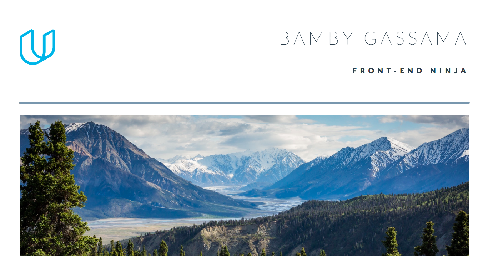

# Portfolio website

# Introduction

For this project, I am building a portfolio website. 

Based on a design mockup as a PDF-file, I am replicating that design in HTML and CSS. 

The website is also responsive displying images, descriptions and links to each of the portfolio projects.

Please click [here](https://portfolio-bamby.netlify.com/) to be redirected to the website. 

# Technologies

* HMTL
* CSS

# Launch

 The project does not have minimum hardware requirements
